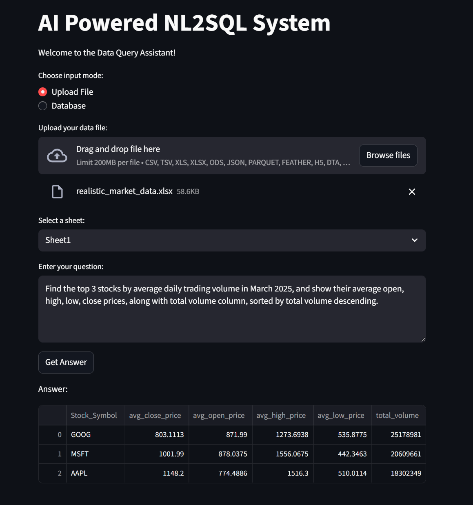

# AI-Powered NL2SQL System

A production-ready Python application that converts **natural language questions** into **SQL queries** and retrieves answers from CSV/Excel files or real databases using **LangChain** and **Ollama LLM**. Built with **Streamlit** for an interactive user interface.

---

## **Features**

- Upload **CSV, TSV, Excel (multi-sheet), JSON, Parquet, Feather, YAML, XML, HDF5, SAS, Stata, compressed files**  
- Connect directly to **SQLite, PostgreSQL, MySQL, SQL Server**  
- Automatically generate SQL from natural language questions using **LangChain + Ollama**  
- Modular and production-ready architecture:
  - `loader.py` → file loading and SQLite conversion  
  - `db_connector.py` → database connection helper  
  - `nl2sql.py` → NL2SQL execution pipeline  
  - `utils.py` → SQL cleaning & extraction  
  - `app.py` → Streamlit frontend  

- Returns results as **pandas DataFrame**, scalar value, or error-friendly messages  
- Supports **multi-file formats** and **large datasets**  

---

## **Installation**

1. **Clone the repository**
git clone TBD
cd nl2sql_app
Create a virtual environment

2. **Create a virtual environment**
python -m venv venv

3. Activate the virtual environment

.\venv\Scripts\Activate

4. Install dependencies
pip install --upgrade pip
pip install -r requirements.txt


## Usage
1. Run the Streamlit app
streamlit run app.py

2. Choose input mode
Upload File: Supports CSV, Excel, JSON, Parquet, YAML, etc.
Database: Connect to SQLite, PostgreSQL, MySQL, or SQL Server.

3. Ask questions
Type natural language questions like:

"Show the top 5 employees by total compensation"

"List all orders in 2024 with quantity > 100"

The system will generate SQL, run it, and display results.

| Natural Language Question                         | Result                                         |
| ------------------------------------------------- | ---------------------------------------------- |
| Average salary per department                     | DataFrame with department and average salary   |
| Top 10 products by revenue                        | DataFrame with product names and total revenue |
| Count employees in ABS 85 Administrative Services | Scalar value                                   |

## Demo / Screenshots

Here are some example outputs of complex queries where the system successfully generated correct SQL:

### Example 1


### Example 2



## Technologies Used
    Python 3.10+
    Pandas, SQLAlchemy – data handling & SQL execution
    LangChain, Ollama LLM – natural language to SQL conversion
    Streamlit – frontend UI
    Openpyxl, xlrd, odfpy, PyArrow, PyYAML – file format support

## Folder Structure
```
nl2sql_system_app/
├── tested_images/
│   ├── CSV_Hard_Level_Query.png
│   └── Excel_Hard_Level_Query.png
├── MVP/
├── Practice files/
├── app2.py
├── loader.py
├── db_connector.py
├── nl2sql.py
├── utils.py
├── requirements.txt
├── README.md
├── LICENSE
└── .gitignore
```

Future Improvements
    Add query history logging for analytics
    Deploy using Docker or Streamlit Cloud
    Add user authentication for multiple users
    Support real-time database updates

License
This project is licensed under the MIT License.